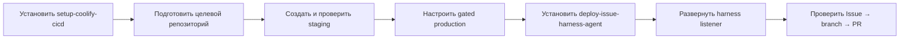
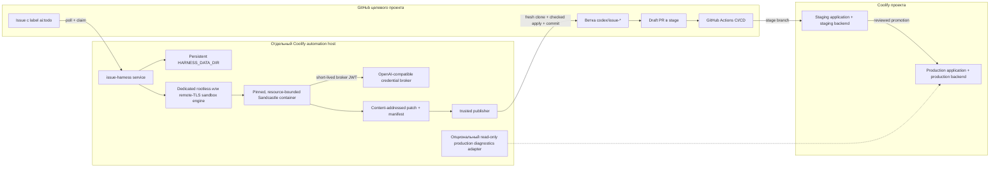
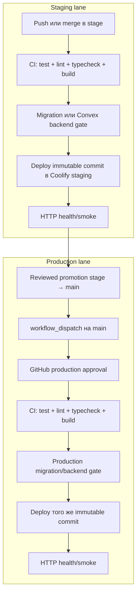
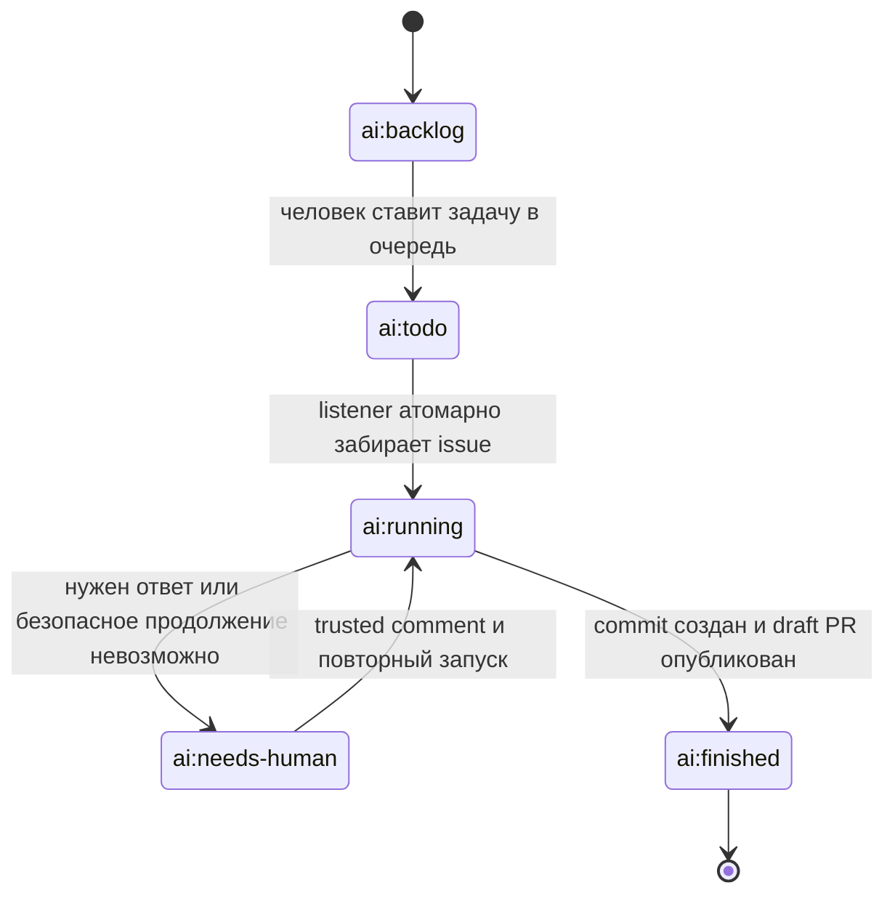

# Harness

Harness — это набор из двух устанавливаемых Codex skills и runtime-сервиса, который превращает GitHub Issues в ограниченные broker-only coding-agent запуски, проверяемые артефакты, ветки и pull request'ы.

Репозиторий решает две отдельные задачи:

1. Подготавливает произвольный проект и заводит для него независимые `stage` и `production` окружения в Coolify.
2. Разворачивает отдельный harness-сервис в Coolify и подключает его к GitHub Issues подготовленного проекта.

Поддерживаемые профили проектов:

- Convex;
- NestJS + PostgreSQL;
- hybrid: приложение использует и Convex, и PostgreSQL/NestJS delivery gates.

## Что находится в репозитории

```text
.
├── skills/
│   ├── setup-coolify-cicd/          # Подготовка проекта + stage/production в Coolify
│   └── deploy-issue-harness-agent/   # Harness-сервис + GitHub Issues
├── services/issue-harness/           # Runtime GitHub Issues listener
├── .sandcastle/                      # Изолированное sandbox-окружение coding agent
├── .github/workflows/                # CI и публикация immutable container images
├── coolify/docker-compose.yml        # Локальный/reference Compose для этого репозитория
├── apps/convex-demo/                 # Небольшое тестовое Convex/Vite приложение
└── tests/                            # Проверки skill scripts и deployment contracts
```

## Два устанавливаемых skills

| Skill | Что делает | Где работает |
| --- | --- | --- |
| [`$setup-coolify-cicd`](skills/setup-coolify-cicd/SKILL.md) | Проверяет и дорабатывает целевой репозиторий, создаёт `stage`/`main`, CI/CD, отдельные staging/production приложения, домены и stateful backends | Целевой GitHub-репозиторий, GitHub Environments, Coolify |
| [`$deploy-issue-harness-agent`](skills/deploy-issue-harness-agent/SKILL.md) | Добавляет issue forms и labels, разворачивает один изолированный harness listener и проверяет полный путь от issue до branch/PR | Целевой GitHub-репозиторий и отдельный Coolify automation host |

На новом проекте skills запускаются строго в таком порядке:



### Как установить skills из этого репозитория

Skills устанавливаются независимо, непосредственно из соответствующих директорий:

- `https://github.com/Void0dev/harness/tree/main/skills/setup-coolify-cicd`
- `https://github.com/Void0dev/harness/tree/main/skills/deploy-issue-harness-agent`

Пример запроса Codex:

```text
Используй $skill-installer и установи skill из GitHub-репозитория
Void0dev/harness, path skills/setup-coolify-cicd.
```

После первого skill аналогично устанавливается `skills/deploy-issue-harness-agent`.

## Общая архитектура



Harness listener не размещается рядом с production workload. Он работает только через отдельный rootless sandbox engine либо mutually authenticated remote-TLS engine на выделенном automation host; production application server для этого не используется.

## Skill 1: подготовить проект и завести его в Coolify

`$setup-coolify-cicd` объединяет repository readiness и внешний Coolify setup. Отдельного промежуточного skill для подготовки репозитория нет.

### Что skill проверяет и добавляет в целевой репозиторий

| Область | Результат |
| --- | --- |
| Project contract | `.harness/config.json` без credential values |
| Build | Lockfile, воспроизводимая install-команда, Dockerfile/Compose/Nixpacks contract |
| Quality gates | Test, lint/typecheck, build и smoke commands |
| Runtime | Health endpoint и container healthcheck |
| Environment | Безопасный `.env.example` только с именами переменных |
| Canonical workflows | `.github/workflows/{ci,coolify-deploy,backend-prepare,coolify-rollback,bootstrap-deployment-evidence}.yml` |
| Branches | `stage` для staging, `main` для production |

Локальную готовность проверяет bundled doctor:

```bash
python3 <skill-dir>/scripts/doctor.py <target-repo> --json
python3 <skill-dir>/scripts/doctor.py <target-repo> --json --run-commands
```

Canonical schema v2 contract — `schemaVersion: 2` с composable capability graph. `coolify.application` присутствует один раз, а `coolify.postgresql` и `convex.deployment` добавляются независимо; hybrid — это композиция обоих, а не отдельный switch. Старый `project.stack` читается только как schema v1 compatibility alias. В machine-readable identifiers `stage` означает ветку и GitHub Environment, а «staging» — соответствующую human-facing lane/Coolify environment; `main` отображается в production. Миграция сначала просматривается без записи:

```bash
python3 <skill-dir>/scripts/migrate_harness.py <target-repo> --dry-run
python3 <skill-dir>/scripts/migrate_harness.py <target-repo> --write
```

`--write` обновляет config и five canonical workflows (`ci`, delivery, backend prepare, rollback и evidence bootstrap) под lock и crash-recovery journal; после сбоя следующий writer сначала восстанавливает подготовленную транзакцию.

### Что skill создаёт или привязывает снаружи

- ветку `stage`, если её ещё нет;
- GitHub Environments `stage` и `production`;
- отдельные Coolify environments/applications для staging и production;
- разные домены;
- разные PostgreSQL resources или Convex deployments;
- lane-specific variables и secrets;
- production approval gate;
- staging deploy и HTTP smoke check.

Skill сначала формирует полностью offline, nonmutating plan. Он не читает credentials, Coolify или GitHub и честно помечает неизвестные application/PostgreSQL/Convex bindings как unresolved:

```bash
python3 <skill-dir>/scripts/coolify_reconcile.py <target-repo> plan
```

Fresh inventory собирается из read-only Coolify/GitHub/Convex наблюдений. Скопируйте подходящий redacted values template (`application`, `nest-postgres`, `convex` или `hybrid`), замените все `null` точными non-secret значениями и дайте генератору создать UUID и десятиминутное окно:

```bash
python3 <skill-dir>/scripts/generate_inventory_fixture.py \
  --profile hybrid \
  --values-json /path/to/hybrid.values.json \
  > /tmp/fresh-inventory.json
```

Templates находятся в `skills/setup-coolify-cicd/assets/inventory-values/`. Они не являются готовым inventory и намеренно не проходят verification до замены всех `null`.

Изменения Coolify выполняются только с явно переданными credentials и флагом записи:

```bash
COOLIFY_URL=https://coolify.example.com \
COOLIFY_TOKEN=... \
COOLIFY_TOKEN_SCOPES=read,write \
COOLIFY_TOKEN_EXPIRES_AT="$TOKEN_EXPIRY_RFC3339" \
COOLIFY_TOKEN_IP_ALLOWLISTED=true \
python3 <skill-dir>/scripts/coolify_reconcile.py <target-repo> apply \
  --allow-external-writes --allow-production-writes \
  --production-approval-ref change-1234 \
  --inventory-json /path/to/fresh-inventory.json
```

Scope, expiry и IP-allowlist fields — operator assertions, пока их не подтверждает отдельная signed/server policy evidence. Apply не мутирует PostgreSQL/Convex backend. Protected backend preparation публикует attested `backend-release-v1`; production application rollout принимает его run/artifact locator вместе с current `deployment-success-v1`, а не mutable variables или copied revision strings.

### Evidence lifecycle, bootstrap и rollback

Deployment authority хранится не в runner cache, environment variables или локальном «latest» файле, а в GitHub artifact, адресуемом immutable locator `{repository, runId, artifactId, artifactName, fileName, sha256}`. Workflow inputs передают run/artifact coordinates; фиксированные repository и `evidence.json`, artifact metadata, SHA-256 и GitHub attestation проверяются до любого PATCH. Каждый record содержит exact `producer={runId,runAttempt,workflowPath,workflowRef,sourceRef,sourceSha,event}`; trusted producer source — только `refs/heads/main`.

- `deployment-success-v1` связывает lane/resource/revision/deployment UUID/health proof, sequence и predecessor. Hosted runner заново скачивает record, проверяет attestation, затем re-verifies live Coolify deployment, current pin, disabled auto-deploy и health. Successor record публикуется только после полного успеха target или compensation.
- `backend-release-v1` — handoff protected backend-prepare → production deploy. Production принимает `backend_evidence_run_id`, `backend_evidence_artifact_id`, `backend_evidence_artifact_name`, связывает release revision/current application anchor/capabilities и после application success публикует `consumption-v1`. Mutable `POSTGRES_*`/`CONVEX_*` variables не являются authority.
- `bootstrap-deployment-evidence.yml` создаёт sequence `0`: `import-existing` проверяет live resource/revision/deployment/success/disabled auto-deploy/health. `initialize-empty` только доказывает `empty-observation-v1` and performs no mutation; normal delivery remains blocked, пока отдельный protected operator/provider process не выполнит initial deployment и `import-existing` не выпустит success evidence. Empty observation никогда не авторизует deploy, rollback или predecessor.
- Manual rollback принимает только `target_evidence_run_id`, `target_evidence_artifact_id`, `target_evidence_artifact_name`; no raw revision вводить нельзя. SHA выводится только из verified historical record, а новый rollback success становится новым chain head.

После post-pin failure workflow компенсирует только к live-reverified predecessor тем же pin→trigger→poll→assert contract; сбой compensation завершается `ROLLBACK_FAILED`. Missing, deleted, malformed, expired или unattested artifact fails closed before mutation. GitHub artifact retention ограничивает rollback horizon: если требуемый срок длиннее, evidence нужно заранее checkpoint/archive в retention-locked append-only store с теми же verification rules.

### Stage и production flow



Staging и production обязаны иметь разные application UUID, domains, credentials и stateful backends. Первый production deployment не выполняется автоматически.

### Проверка установленного delivery workflow

```bash
python3 <skill-dir>/scripts/validate_workflow.py <target-repo>

COOLIFY_URL=https://coolify.example.com \
COOLIFY_TOKEN=... \
python3 <skill-dir>/scripts/coolify_reconcile.py <target-repo> verify \
  --inventory-json /path/to/fresh-inventory.json
```

Validator работает fail-closed: отклоняет неизвестный capability kind, дополнительные jobs/actions/triggers, permission escalation, произвольные runners, неверные secrets, пропущенные gates и синтаксически невалидный YAML. Fragment assets — только internal input единственного `workflow_compiler.py`; вручную объединять их нельзя.

## Skill 2: установить harness service и подключить Issues

`$deploy-issue-harness-agent` устанавливается после первого skill. Для каждого целевого репозитория разворачивается отдельный listener с одной репликой и `MAX_CONCURRENT_RUNS=1`.

### Что добавляется в целевой репозиторий

- `.github/ISSUE_TEMPLATE/agent-task.yml`;
- `.sandcastle/prompt.md`;
- labels `ai:backlog`, `ai:todo`, `ai:running`, `ai:finished`, `ai:needs-human`;
- опциональные `production-incident.yml` и `production:diagnose`;
- проверенные non-secret bindings в `.harness/config.json`.

### Что создаётся в Coolify

- отдельное приложение `harness-<owner>-<repo>` в environment `automation`;
- immutable `issue-harness` и `sandcastle-harness` images, закреплённые по SHA-256 digest;
- persistent host directory `/opt/issue-harness/<owner>-<repository>`;
- bind mount с одинаковым host/container path;
- раздельные endpoints на порту `3000`: `/live`, `/ready`, `/health/worker` и защищённый bearer-токеном `/identity`;
- repository-scoped GitHub credential;
- внутренний OpenAI-compatible broker с short-lived per-run JWT;
- package-read-only registry credential, если GHCR images приватные.

Canonical image coordinates и правила provenance находятся в [`references/image-release.md`](skills/deploy-issue-harness-agent/references/image-release.md). Harness и sandbox images должны происходить из одного trusted source commit.

### Жизненный цикл issue



Listener принимает инструкции из issue и follow-up comments только от GitHub owner/member/collaborator associations. Комментарии, статусы запуска и ссылка на PR записываются обратно в issue.

### Runtime flow

1. Listener опрашивает GitHub Issues и забирает `ai:todo`.
2. Для запуска создаётся fresh single-branch clone `stage`; remote удаляется, hooks и ambient Git config отключаются.
3. Sandcastle получает только throwaway workspace, новый per-run `CODEX_HOME` и short-lived broker JWT. GitHub, Coolify, database и upstream OpenAI credentials в sandbox не передаются.
4. Успех принимается только при completion marker и изменениях относительно exact base SHA. Sandbox формирует content-addressed binary patch + manifest; symlink/submodule/unsafe path, oversized output и secret-shaped material отклоняются.
5. Untrusted workspace и `CODEX_HOME` удаляются. Trusted publisher независимо клонирует текущий `stage`, сверяет base SHA и hashes, выполняет `git apply --check`, создаёт commit и публикует новую `codex/issue-*` ветку без запуска repository hooks.
6. Создаётся или переиспользуется draft PR в `stage`. Повторная публикация использует сохранённый immutable artifact и не перезапускает coding agent; изменившийся base требует нового run.

### Планирование labels и проверка агента

```bash
python3 <skill-dir>/scripts/github_labels.py owner/repo plan
python3 <skill-dir>/scripts/github_labels.py owner/repo apply --allow-external-writes

python3 <skill-dir>/scripts/generate_agent_inventory_fixture.py \
  --values-json /path/to/agent-rollout.values.json \
  > /tmp/fresh-agent-inventory.json

AGENT_HEALTH_TOKEN=... python3 <skill-dir>/scripts/verify_agent.py <target-repo> \
  --health-origin https://harness.example.com \
  --inventory-json /tmp/fresh-agent-inventory.json \
  --harness-manifest /evidence/issue-harness-index.json \
  --sandbox-manifest /evidence/sandcastle-index.json \
  --harness-attestation-bundle /evidence/issue-harness-attestation.jsonl \
  --sandbox-attestation-bundle /evidence/sandcastle-attestation.jsonl \
  --trusted-root /evidence/trusted_root.jsonl \
  --source-ref refs/heads/main
```

Coolify inventory доказывает только running rollout. Provenance не задаётся boolean-полями: verifier offline проверяет локальные OCI manifests, cryptographically signed GitHub bundles и trusted root, связывая оба subject digests с canonical repository/workflow, trusted ref, source commit и одним publication run.

## Production diagnostics

Production diagnostics — отдельная опциональная capability, а не расширение прав coding listener.

Разрешены только:

- health read;
- logs query;
- traces query;
- metrics query;
- deployment status read.

Запрещены shell/SSH, SQL writes, Coolify `write`/`deploy`, application credentials и любые mutation paths. В `.harness/config.json` это выражается как `productionAgent.mode=diagnose-only` и `mutationPath=none`.

## Основные переменные harness service

| Переменная | Назначение |
| --- | --- |
| `GITHUB_TOKEN` | Repository-scoped доступ к issues, contents и pull requests |
| `GITHUB_OWNER`, `GITHUB_REPO` | Целевой репозиторий |
| `GITHUB_BASE_BRANCH` | Всегда `stage` |
| `HARNESS_DATA_DIR` | Persistent per-repository host directory |
| `CODEX_AUTH_MODE` | Только `broker`; другие modes fail closed |
| `CODEX_BROKER_URL`, `CODEX_BROKER_AUDIENCE` | Internal OpenAI-compatible `/v1` endpoint и JWT audience |
| `CODEX_BROKER_SIGNING_SECRET` | 32+ character signing secret, доступный listener и broker, но не sandbox |
| `SANDBOX_NETWORK` | Предварительно созданная Docker internal network только для sandbox↔broker |
| `SANDBOX_MEMORY_MB`, `SANDBOX_CPUS`, `SANDBOX_PIDS_LIMIT`, `SANDBOX_TMPFS_MB`, `SANDBOX_MAX_OUTPUT_BYTES` | Явные resource/output bounds |
| `HARNESS_IMAGE` | Immutable image digest самого listener |
| `SANDCASTLE_IMAGE` | Immutable sandbox image digest |
| `SANDBOX_REGISTRY_*` | Read-only registry login для private sandbox image |
| `MAX_CONCURRENT_RUNS` | Сейчас должен быть `1` |

Шаблон production Compose находится в [`skills/deploy-issue-harness-agent/assets/coolify-agent-compose.yml`](skills/deploy-issue-harness-agent/assets/coolify-agent-compose.yml).

## Безопасность

- Не хранить credential values в Git, `.harness/config.json` или `.env.example`.
- Использовать только immutable images вида `image@sha256:<64-hex>`; `latest` запрещён.
- Не использовать rootful host engine endpoint; разрешены отдельный rootless daemon или remote TLS с per-repository client certificates.
- Не передавать upstream OpenAI key или persistent Codex home в sandbox: только ограниченный broker JWT и новый per-run home.
- Перед broker-only upgrade оператор должен безопасно архивировать или удалить legacy `$HARNESS_DATA_DIR/auth` и `$HARNESS_DATA_DIR/codex`; runtime намеренно не удаляет credential material и fail closed, пока эти директории существуют.
- Runtime закрепляет один процесс через kernel `process.lock`, сериализует операции через `runtime.lock` и хранит immutable `repository-identity.json`; эти файлы нельзя переносить между репозиториями.
- Не давать coding listener production deploy/write credentials.
- Не смешивать staging и production domains, databases, Convex deployments или secrets.
- Не делать force-push `stage` или `main`.
- Не запускать первый production deployment и destructive migrations без явного разрешения.
- Не считать локальный config доказательством внешнего состояния: Coolify/GitHub bindings подтверждаются свежим inventory и health checks.

## Локальная разработка

```bash
npm ci
cp .env.example .env
npm run lint
npm run typecheck
npm test
npm run build
```

Запуск demo:

```bash
npm run dev:demo
```

Запуск issue harness:

```bash
npm run dev:harness
```

Для прямого локального запуска `HARNESS_DATA_DIR` можно не задавать: runtime использует repository-local `.harness`. В Coolify он должен быть абсолютным non-symlinked путём внутри `/opt/issue-harness/`.

## Публикация images

Workflow [`.github/workflows/publish-images.yml`](.github/workflows/publish-images.yml) публикует два образа:

- `ghcr.io/void0dev/issue-harness`;
- `ghcr.io/void0dev/sandcastle-harness`.

Image build и attestation разрешены только из `refs/heads/main`. Tag push не запускает rebuild, а ручной `workflow_dispatch` с любого non-main ref падает до checkout/registry login/build/push. Version promotion может лишь добавить alias к уже проверенному main-built digest без изменения его GitHub attestation; в Coolify используются только digest references из одного успешного main workflow run.

## Проверка репозитория

```bash
npm run typecheck
npm test
npm run lint
npm run build
npm audit --omit=dev
```

Skill-specific regression tests находятся в `tests/test_skills.py`; runtime tests — в `services/issue-harness/test/`.

## Что считается завершением

| Claim | Доказательство |
| --- | --- |
| `repo-ready` | Свежие install/test/lint/typecheck/build/smoke и успешный doctor |
| `cicd-bound` | Fresh inventory подтверждает разные stage/prod applications, domains и backends |
| `stage-healthy` | Успешный immutable staging deploy и HTTP smoke |
| `production-configured` | Production связан и защищён approval gate, но необязательно уже развёрнут |
| `issue-agent-online` | Один verifier run подтверждает offline provenance, exact running rollout, `/live`, `/ready`, `/health/worker` и защищённый `/identity` |
| `issue-listener-e2e` | Контрольный issue дошёл до branch и draft PR |

Полностью рабочей установка считается только после проверенного staging deployment и успешного Issue → branch → PR smoke.
