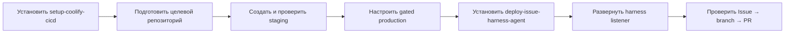
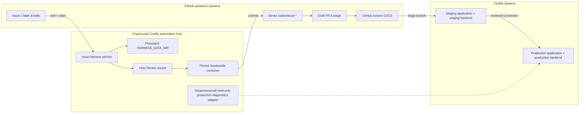
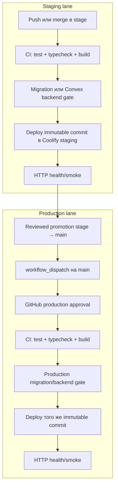
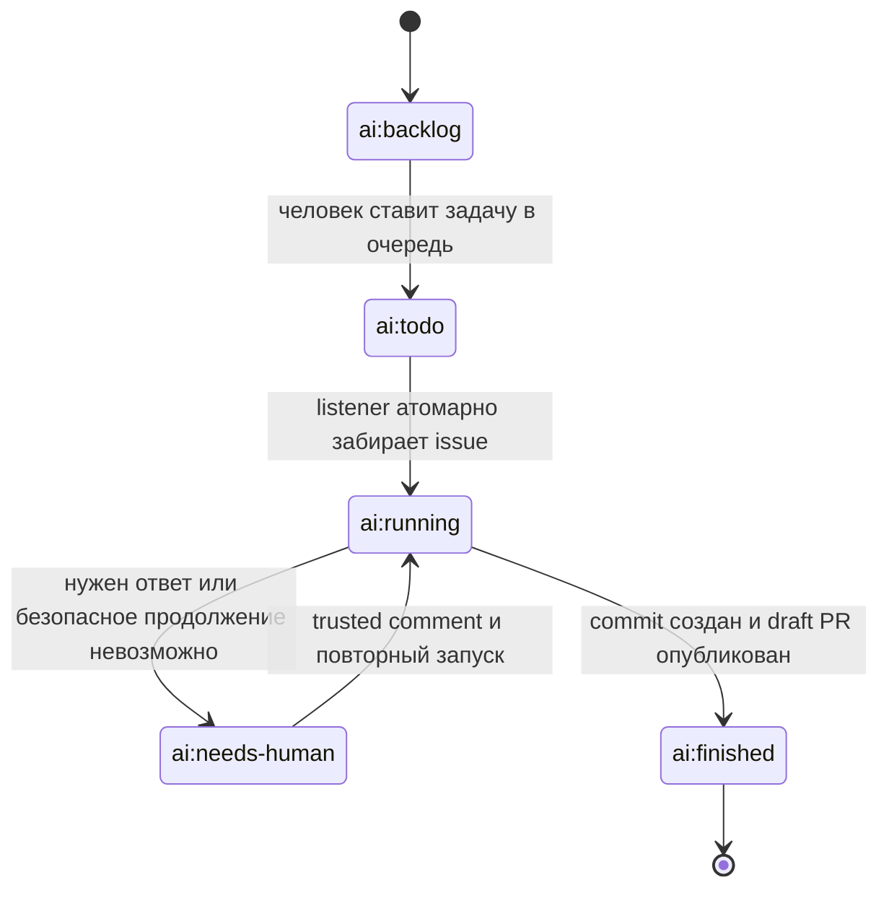

# Harness

Harness — это набор из двух устанавливаемых Codex skills и runtime-сервиса, который превращает GitHub Issues в изолированные coding-agent запуски, ветки и pull request'ы.

Репозиторий решает две отдельные задачи:

1. Подготавливает произвольный проект и заводит для него независимые `stage` и `production` окружения в Coolify.
2. Разворачивает отдельный harness-сервис в Coolify и подключает его к GitHub Issues подготовленного проекта.

Поддерживаемые профили проектов:

- Convex;
- NestJS + PostgreSQL;
- hybrid: приложение использует и Convex, и PostgreSQL/NestJS delivery gates.

## Что находится в репозитории

```text
.
├── skills/
│   ├── setup-coolify-cicd/          # Подготовка проекта + stage/production в Coolify
│   └── deploy-issue-harness-agent/   # Harness-сервис + GitHub Issues
├── services/issue-harness/           # Runtime GitHub Issues listener
├── .sandcastle/                      # Изолированное sandbox-окружение coding agent
├── .github/workflows/                # CI и публикация immutable container images
├── coolify/docker-compose.yml        # Локальный/reference Compose для этого репозитория
├── apps/convex-demo/                 # Небольшое тестовое Convex/Vite приложение
└── tests/                            # Проверки skill scripts и deployment contracts
```

## Два устанавливаемых skills

| Skill | Что делает | Где работает |
| --- | --- | --- |
| [`$setup-coolify-cicd`](skills/setup-coolify-cicd/SKILL.md) | Проверяет и дорабатывает целевой репозиторий, создаёт `stage`/`main`, CI/CD, отдельные staging/production приложения, домены и stateful backends | Целевой GitHub-репозиторий, GitHub Environments, Coolify |
| [`$deploy-issue-harness-agent`](skills/deploy-issue-harness-agent/SKILL.md) | Добавляет issue forms и labels, разворачивает один изолированный harness listener и проверяет полный путь от issue до branch/PR | Целевой GitHub-репозиторий и отдельный Coolify automation host |

На новом проекте skills запускаются строго в таком порядке:



### Как установить skills из этого репозитория

Skills устанавливаются независимо, непосредственно из соответствующих директорий:

- `https://github.com/Void0dev/harness/tree/main/skills/setup-coolify-cicd`
- `https://github.com/Void0dev/harness/tree/main/skills/deploy-issue-harness-agent`

Пример запроса Codex:

```text
Используй $skill-installer и установи skill из GitHub-репозитория
Void0dev/harness, path skills/setup-coolify-cicd.
```

После первого skill аналогично устанавливается `skills/deploy-issue-harness-agent`.

## Общая архитектура



Harness listener не размещается рядом с production workload. Он получает Docker socket и поэтому должен работать на выделенном Coolify server/destination.

## Skill 1: подготовить проект и завести его в Coolify

`$setup-coolify-cicd` объединяет repository readiness и внешний Coolify setup. Отдельного промежуточного skill для подготовки репозитория нет.

### Что skill проверяет и добавляет в целевой репозиторий

| Область | Результат |
| --- | --- |
| Project contract | `.harness/config.json` без credential values |
| Build | Lockfile, воспроизводимая install-команда, Dockerfile/Compose/Nixpacks contract |
| Quality gates | Test, lint/typecheck, build и smoke commands |
| Runtime | Health endpoint и container healthcheck |
| Environment | Безопасный `.env.example` только с именами переменных |
| CI | `.github/workflows/ci.yml` |
| Delivery | `.github/workflows/coolify-deploy.yml` |
| Branches | `stage` для staging, `main` для production |

Локальную готовность проверяет bundled doctor:

```bash
python3 <skill-dir>/scripts/doctor.py <target-repo> --json
python3 <skill-dir>/scripts/doctor.py <target-repo> --json --run-commands
```

### Что skill создаёт или привязывает снаружи

- ветку `stage`, если её ещё нет;
- GitHub Environments `stage` и `production`;
- отдельные Coolify environments/applications для staging и production;
- разные домены;
- разные PostgreSQL resources или Convex deployments;
- lane-specific variables и secrets;
- production approval gate;
- staging deploy и HTTP smoke check.

Skill сначала формирует read-only план:

```bash
python3 <skill-dir>/scripts/coolify_reconcile.py <target-repo> plan
```

Изменения Coolify выполняются только с явно переданными credentials и флагом записи:

```bash
COOLIFY_URL=https://coolify.example.com \
COOLIFY_TOKEN=... \
python3 <skill-dir>/scripts/coolify_reconcile.py <target-repo> apply \
  --allow-external-writes \
  --inventory-json /path/to/fresh-inventory.json
```

### Stage и production flow



Staging и production обязаны иметь разные application UUID, domains, credentials и stateful backends. Первый production deployment не выполняется автоматически.

### Проверка установленного delivery workflow

```bash
python3 <skill-dir>/scripts/validate_workflow.py <target-repo>

COOLIFY_URL=https://coolify.example.com \
COOLIFY_TOKEN=... \
python3 <skill-dir>/scripts/coolify_reconcile.py <target-repo> verify \
  --inventory-json /path/to/fresh-inventory.json
```

Validator работает fail-closed: отклоняет неизвестный stack, дополнительные jobs/actions/triggers, permission escalation, произвольные runners, неверные secrets, пропущенные gates и синтаксически невалидный YAML.

## Skill 2: установить harness service и подключить Issues

`$deploy-issue-harness-agent` устанавливается после первого skill. Для каждого целевого репозитория разворачивается отдельный listener с одной репликой и `MAX_CONCURRENT_RUNS=1`.

### Что добавляется в целевой репозиторий

- `.github/ISSUE_TEMPLATE/agent-task.yml`;
- `.sandcastle/prompt.md`;
- labels `ai:backlog`, `ai:todo`, `ai:running`, `ai:finished`, `ai:needs-human`;
- опциональные `production-incident.yml` и `production:diagnose`;
- проверенные non-secret bindings в `.harness/config.json`.

### Что создаётся в Coolify

- отдельное приложение `harness-<owner>-<repo>` в environment `automation`;
- immutable `issue-harness` и `sandcastle-harness` images, закреплённые по SHA-256 digest;
- persistent host directory `/opt/issue-harness/<owner>-<repository>`;
- bind mount с одинаковым host/container path;
- health endpoint `/health` на порту `3000`;
- repository-scoped GitHub credential;
- Codex subscription или API-key auth;
- package-read-only registry credential, если GHCR images приватные.

Canonical image coordinates и правила provenance находятся в [`references/image-release.md`](skills/deploy-issue-harness-agent/references/image-release.md). Harness и sandbox images должны происходить из одного trusted source commit.

### Жизненный цикл issue



Listener принимает инструкции из issue и follow-up comments только от GitHub owner/member/collaborator associations. Комментарии, статусы запуска и ссылка на PR записываются обратно в issue.

### Runtime flow

1. Listener опрашивает GitHub Issues и забирает `ai:todo`.
2. Целевой репозиторий клонируется в `$HARNESS_DATA_DIR/workspaces/<owner>/<repo>`.
3. Для issue создаётся или восстанавливается ветка `codex/issue-*`.
4. Sandcastle запускает coding agent в sibling Docker container.
5. Успех принимается только при явном completion marker и новом commit относительно `stage`.
6. Listener push'ит ветку через process-local GitHub auth header.
7. Создаётся или переиспользуется draft PR в `stage`.
8. Если публикация PR временно упала, она повторяется без повторного запуска coding agent.

### Планирование labels и проверка агента

```bash
python3 <skill-dir>/scripts/github_labels.py owner/repo plan
python3 <skill-dir>/scripts/github_labels.py owner/repo apply --allow-external-writes

python3 <skill-dir>/scripts/verify_agent.py <target-repo> \
  --health-url https://harness.example.com/health \
  --inventory-json /path/to/fresh-agent-inventory.json
```

## Production diagnostics

Production diagnostics — отдельная опциональная capability, а не расширение прав coding listener.

Разрешены только:

- health read;
- logs query;
- traces query;
- metrics query;
- deployment status read.

Запрещены shell/SSH, SQL writes, Coolify `write`/`deploy`, application credentials и любые mutation paths. В `.harness/config.json` это выражается как `productionAgent.mode=diagnose-only` и `mutationPath=none`.

## Основные переменные harness service

| Переменная | Назначение |
| --- | --- |
| `GITHUB_TOKEN` | Repository-scoped доступ к issues, contents и pull requests |
| `GITHUB_OWNER`, `GITHUB_REPO` | Целевой репозиторий |
| `GITHUB_BASE_BRANCH` | Всегда `stage` |
| `HARNESS_DATA_DIR` | Persistent per-repository host directory |
| `CODEX_AUTH_MODE` | `subscription` или `api-key` |
| `OPENAI_API_KEY` | Нужен только при `CODEX_AUTH_MODE=api-key` |
| `HARNESS_IMAGE` | Immutable image digest самого listener |
| `SANDCASTLE_IMAGE` | Immutable sandbox image digest |
| `SANDBOX_REGISTRY_*` | Read-only registry login для private sandbox image |
| `MAX_CONCURRENT_RUNS` | Сейчас должен быть `1` |

Шаблон production Compose находится в [`skills/deploy-issue-harness-agent/assets/coolify-agent-compose.yml`](skills/deploy-issue-harness-agent/assets/coolify-agent-compose.yml).

## Безопасность

- Не хранить credential values в Git, `.harness/config.json` или `.env.example`.
- Использовать только immutable images вида `image@sha256:<64-hex>`; `latest` запрещён.
- Размещать raw-Docker-socket harness только на выделенном automation host.
- Не давать coding listener production deploy/write credentials.
- Не смешивать staging и production domains, databases, Convex deployments или secrets.
- Не делать force-push `stage` или `main`.
- Не запускать первый production deployment и destructive migrations без явного разрешения.
- Не считать локальный config доказательством внешнего состояния: Coolify/GitHub bindings подтверждаются свежим inventory и health checks.

## Локальная разработка

```bash
npm ci
cp .env.example .env
npm run typecheck
npm test
npm run build
```

Запуск demo:

```bash
npm run dev:demo
```

Запуск issue harness:

```bash
npm run dev:harness
```

Для прямого локального запуска `HARNESS_DATA_DIR` можно не задавать: runtime использует repository-local `.harness`. В Coolify он должен быть абсолютным non-symlinked путём внутри `/opt/issue-harness/`.

## Публикация images

Workflow [`.github/workflows/publish-images.yml`](.github/workflows/publish-images.yml) публикует два образа:

- `ghcr.io/void0dev/issue-harness`;
- `ghcr.io/void0dev/sandcastle-harness`.

Публикация выполняется для `main`, `v*` tags или вручную. В Coolify используются только digest references из одного успешного workflow run.

## Проверка репозитория

```bash
npm run typecheck
npm test
npm run build
npm audit --omit=dev
```

Skill-specific regression tests находятся в `tests/test_skills.py`; runtime tests — в `services/issue-harness/test/`.

## Что считается завершением

| Claim | Доказательство |
| --- | --- |
| `repo-ready` | Свежие install/test/typecheck/build/smoke и успешный doctor |
| `cicd-bound` | Fresh inventory подтверждает разные stage/prod applications, domains и backends |
| `stage-healthy` | Успешный immutable staging deploy и HTTP smoke |
| `production-configured` | Production связан и защищён approval gate, но необязательно уже развёрнут |
| `issue-agent-online` | `/health` возвращает ожидаемый target repository |
| `issue-listener-e2e` | Контрольный issue дошёл до branch и draft PR |

Полностью рабочей установка считается только после проверенного staging deployment и успешного Issue → branch → PR smoke.
