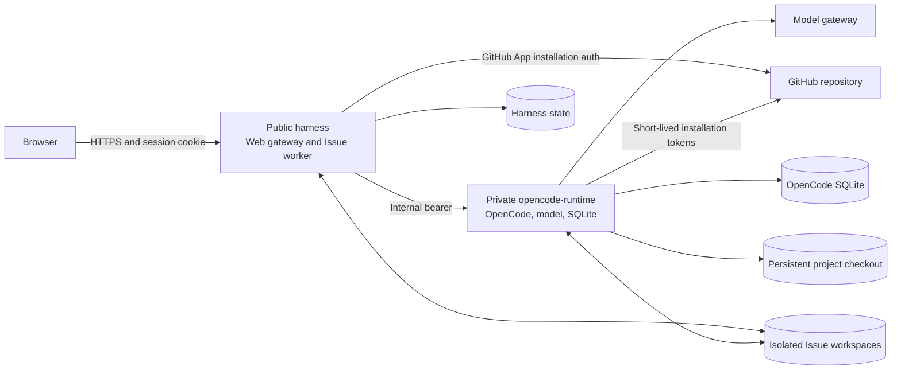
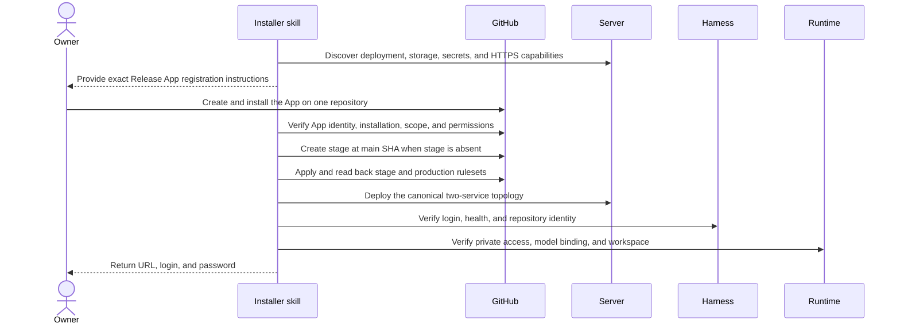
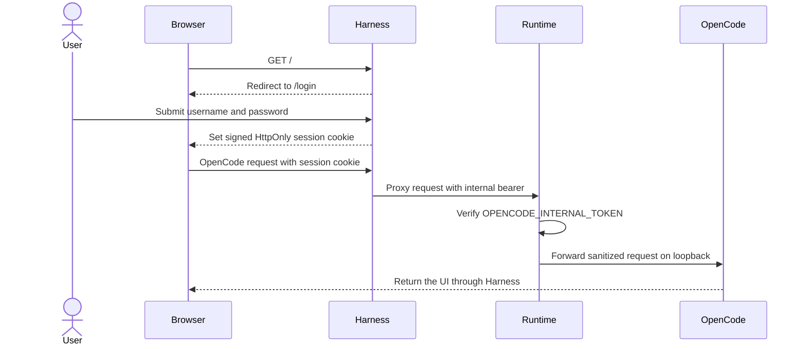
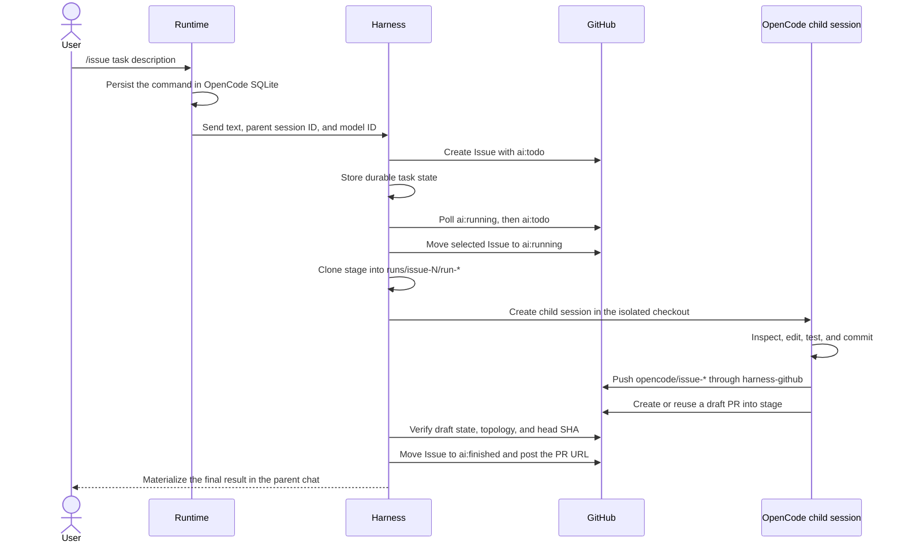
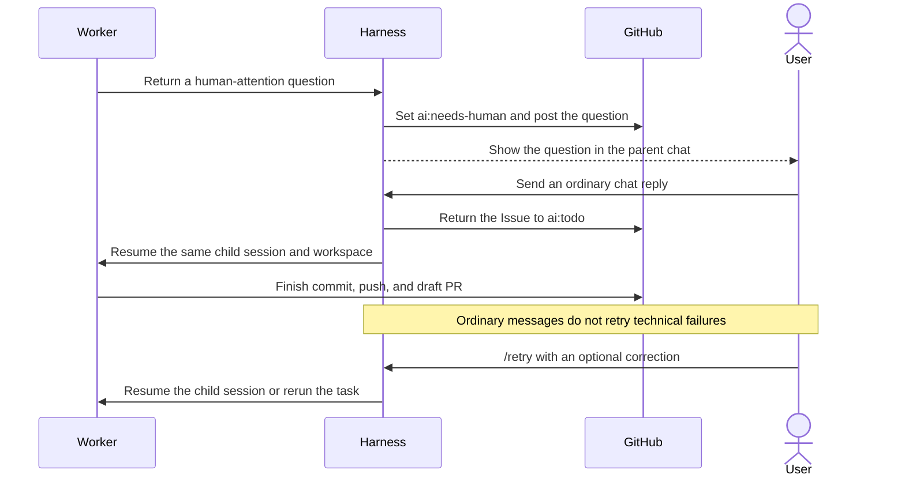
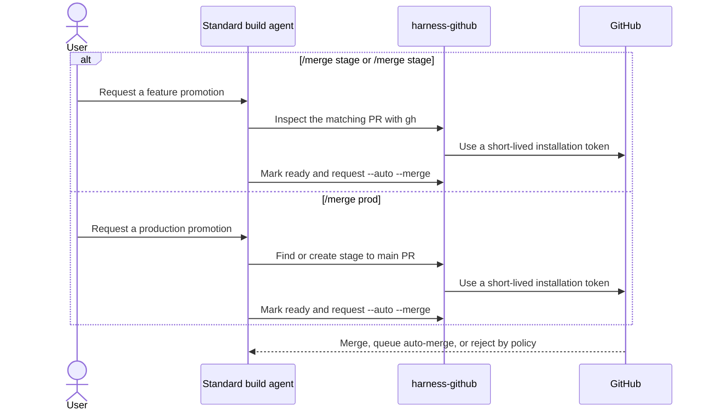

# OpenCode Harness

OpenCode Harness attaches an authenticated OpenCode workspace to an existing GitHub repository and turns GitHub Issues into tested code changes and draft pull requests targeting `stage`.

The runtime does not use Codex. One standard OpenCode `build` agent acts as the chat agent, coding agent, and GitHub operator. It can inspect and edit the project, run commands and tests, commit and push changes, create pull requests, and perform explicitly requested merge operations. The actual security boundary is enforced by the repository-scoped Release App permissions and GitHub rulesets.

## Architecture

The deployed stack contains exactly two services. The public gateway is part of `harness`; it is not a third service.



### Public `harness`

- Exposes the authenticated HTTPS entry point.
- Verifies web login and signed browser sessions.
- Polls GitHub Issues and manages Harness labels.
- Creates and resumes OpenCode child sessions.
- Stores durable Issue-run and task-card state.
- Verifies that the coding agent created the expected draft pull request.
- Exposes bounded health, identity, diagnostics, and internal command endpoints.

### Private `opencode-runtime`

- Runs the OpenCode server and the standard `build` agent.
- Stores OpenCode sessions in SQLite.
- Receives the model gateway URL, model ID, and model key.
- Mounts the persistent writable project checkout.
- Mounts the isolated checkout created for each Issue run.
- Provides `harness-github` for authenticated `git` and `gh` commands.
- Accepts requests only through `OPENCODE_INTERNAL_TOKEN` and has no public route.

## Installation

The repository contains one installer skill: [`deploy-opencode-harness`](skills/deploy-opencode-harness/SKILL.md). It discovers whatever server and deployment capabilities are already available instead of requiring a specific hosting provider, SSH transport, or deployment API.



The required Release App configuration is:

- Metadata: read-only
- Contents: read/write
- Issues: read/write
- Pull requests: read/write
- Checks: read-only
- Administration: disabled
- Repository access: only the target repository
- Webhooks: disabled; Harness uses polling

`main` must already exist. The installer creates a missing `stage` exactly once at the current `main` SHA. It never resets, replaces, deletes, or force-pushes an existing branch.

The installer manages only the namespaced `harness-stage` and `harness-production` rulesets. A temporary owner or bootstrap authority is required to configure rulesets because the Release App deliberately has no Administration permission.

Only the two-service Harness stack is deployed. The installer does not inspect, modify, or deploy the target application or its databases, containers, secrets, domains, or logs.

## Web Login and Runtime Access



The browser never receives `HARNESS_COMMAND_TOKEN`, `OPENCODE_INTERNAL_TOKEN`, a GitHub installation token, or the model key. Harness removes browser authorization before proxying and supplies the internal runtime bearer itself.

Normal chat uses the persistent writable project checkout. The standard agent can inspect, edit, test, commit, push, create pull requests, and perform other GitHub operations allowed by the Release App and repository rulesets.

## Issue Workflow

Run the following command in a project chat:

```text
/issue <task description>
```

The command is persisted in the OpenCode conversation immediately. Runtime dispatch to Harness happens asynchronously, so the user message remains visible even if Harness or GitHub later rejects the request.



The Issue body contains hidden markers that link it to the visible parent OpenCode session and, when available, the selected model. An Issue created directly in GitHub receives its own visible parent session when Harness picks it up.

One repository can execute only one coding run at a time. Different parent chats may queue Issues, but one parent chat may own only one unfinished Issue.

### Worker Completion Contract

The child session works only in its isolated checkout and generated `opencode/issue-*` branch. It must:

1. Make the smallest useful change that satisfies the Issue.
2. Add or update tests when the change has behavioral risk.
3. Run the most relevant available verification.
4. Commit all completed changes.
5. Push the branch through `harness-github git`.
6. Create or reuse a draft pull request into `stage` through `harness-github gh`.
7. Never merge the feature branch or open it directly into `main`.

Harness accepts completion only when all of these conditions hold:

- The worker emitted the required completion marker.
- The branch contains at least one commit ahead of the captured `stage` SHA.
- The execution checkout is clean.
- The expected pull request exists, is open, and is still a draft.
- The pull request head is the generated feature branch and the base is exactly `stage`.
- The pull request head SHA matches the completed local branch SHA.

The normal Issue workflow always stops at this verified draft pull request. No model text, label, successful check, or timer triggers a merge automatically.

## Human Questions and Retry



A real worker question accepts the next ordinary message in the same parent chat. Trusted GitHub comments from an owner, member, or collaborator can also answer the question after a bounded debounce window.

A technical failure is intentionally different. Ordinary conversation cannot restart coding accidentally; the user must issue `/retry`. When the child session and workspace are recoverable, Harness resumes them. Otherwise it prepares a fresh run.

After a Harness restart, queued work remains queued, an interrupted coding session is moved to an explicit technical-failure state that requires `/retry`, and a run that had already reached publication is reconciled against its existing local branch and draft pull request. Harness never starts a replacement coding run merely because a persisted Issue still has `ai:running`.

## Explicit Merge Operations

Harness has no merge endpoint, merge service, release role, publisher pipeline, or merge ledger. `/merge` is an ordinary command prompt executed by the same standard OpenCode `build` agent.



Supported commands:

- `/merge stage`: require one unambiguous open Harness feature PR targeting `stage`.
- `/merge stage #<issue>`: select the feature PR linked to that Issue.
- `/merge prod`: create or reuse only the `stage -> main` promotion PR.

The agent re-reads current GitHub state for every request. Feature branches are never merged directly into `main`. GitHub permissions, required checks, reviews, branch protections, and rulesets determine whether the requested operation can actually complete.

## GitHub Authentication

Both services receive the same repository-scoped App ID, Installation ID, repository coordinates, base branch, and read-only PEM mount.

Harness uses Octokit installation authentication for Issue polling and state synchronization. Runtime GitHub operations use `harness-github`, which creates a GitHub App JWT and requests a fresh installation token for each `git` or `gh` process.

- `gh` receives the token only through the child process `GH_TOKEN`.
- `git` receives it through a process-local Git `extraHeader`.
- App IDs, PEM paths, and existing GitHub token variables are removed from the child environment.
- Tokens are never stored in Git remotes, Harness state, or the project workspace.

## Task State in OpenCode

Harness stores a sanitized durable task projection containing the Issue number, status, observed stages, human question, summary, changed files, worker session path, model metadata, and pull request URL.

The runtime periodically reads that projection, materializes it as native OpenCode messages in SQLite, and publishes compatible `message.updated` and `message.part.updated` SSE events. The task response therefore survives refreshes and appears in the original conversation instead of living only in temporary browser state.

While the worker is active, the response shows compact progress. On completion, failure, or a human question, the same response is replaced with the durable result.

## Persistent Data

| Location | Purpose |
| --- | --- |
| `$HARNESS_DATA_DIR/context` | Persistent writable project checkout used by normal chat |
| `$HARNESS_DATA_DIR/opencode` | OpenCode SQLite database and session history |
| `$HARNESS_DATA_DIR/runs/issue-N/run-*` | Isolated temporary checkout for an Issue worker |
| `$HARNESS_DATA_DIR/state/runs.json` | Durable Harness run and task-view state |
| GitHub | Issues, comments, branches, checks, rulesets, and pull requests |

On first startup Harness clones `stage` into `context`. On later startups it may fast-forward only a clean local `stage`. A different checked-out branch or any uncommitted project work is preserved.

Each Issue receives a separate temporary clone, so automated Issue work cannot modify the persistent interactive checkout. Finished workspaces are removed only after the configured retention period.

Harness compacts finished history down to the latest 500 run records and removes workspaces belonging to pruned records. Active, queued, and human-blocked runs are never removed by history compaction.

Harness state is written atomically with private file permissions and rejects credential-shaped fields.

## Trust Boundaries

- The OpenCode agent is intentionally allowed to use normal edit, shell, Git, and GitHub tools.
- Agent configuration is not the security boundary for repository operations.
- Release App permissions define which GitHub APIs and repository operations are available.
- `harness-stage` and `harness-production` rulesets control protected branch updates and merges.
- Release App ruleset bypass is limited to pull-request operations and is never unrestricted.
- The web password and session-signing secret exist only in `harness`.
- The model key and OpenCode SQLite database exist only in `opencode-runtime`.
- The browser receives none of the internal service or GitHub credentials.
- Server and deployment credentials never enter OpenCode coding sessions.
- No Sandcastle, model broker, Docker socket, privileged container, or separate coding container is part of the architecture.

## Model Gateway

Chat and coding use one configured model gateway:

```text
VOID_AI_BASE_URL=https://ai-gateway.void0.org/v1
VOID_AI_API_KEY=<secret key>
VOID_AI_MODEL_ID=<exact model ID available through the gateway>
```

`VOID_AI_API_KEY` is provided only to the private `opencode-runtime`. Public `harness` never receives it.

## Local Verification on Windows

Use a separate test GitHub repository. `main` must exist. Install the Release App only on that repository with the permissions listed above.

1. Create the local environment file:

   ```powershell
   Copy-Item .env.local.example .env.local
   ```

2. Populate `.env.local`:

   ```text
   GITHUB_APP_ID=
   GITHUB_APP_INSTALLATION_ID=
   GITHUB_APP_PRIVATE_KEY_PATH=/run/secrets/github-app.pem
   GITHUB_OWNER=
   GITHUB_REPO=
   HARNESS_COMMAND_TOKEN=
   VOID_AI_API_KEY=
   VOID_AI_MODEL_ID=
   OPENCODE_SERVER_PASSWORD=
   HARNESS_HEALTH_DETAILS_TOKEN=
   ```

   Place the Release App PEM key in the Harness root as `github-app-private-key.pem`. `HARNESS_COMMAND_TOKEN` and `HARNESS_HEALTH_DETAILS_TOKEN` must be different random strings containing at least 32 characters. Do not commit `.env.local` or the PEM file.

3. Validate Compose:

   ```powershell
   docker compose --env-file .env.local -f docker-compose.local.yml config --quiet
   ```

4. Build and start the services:

   ```powershell
   docker compose --env-file .env.local -f docker-compose.local.yml build
   docker compose --env-file .env.local -f docker-compose.local.yml up
   ```

5. Open `http://localhost:4096` and sign in with username `opencode` and the value of `OPENCODE_SERVER_PASSWORD`.

6. Ask a normal question about the test project. The standard OpenCode agent should see the repository and be able to inspect and edit files.

7. In the same chat, send:

   ```text
   /issue Add a small safe change and its corresponding test
   ```

8. Expected GitHub result:

   - The Issue receives `ai:todo`, followed by `ai:running`.
   - A worker session appears in OpenCode Web.
   - An `opencode/issue-<number>-...` branch is pushed.
   - A draft pull request targeting `stage` is created.
   - The Issue receives `ai:finished` and a link to the pull request.
   - The pull request remains a draft until an explicit `/merge` command.

9. Stop the services:

   ```powershell
   docker compose --env-file .env.local -f docker-compose.local.yml down
   ```

The `.local-harness` directory preserves project context, Harness state, Issue workspaces, and OpenCode sessions between restarts.

## Development Checks

On Linux and macOS, use the same scripts without the Windows suffix: `npm run lint`, `npm run typecheck`, `npm run build`, and `npm test`.

```powershell
npm.cmd ci
npm.cmd run lint
npm.cmd run typecheck
npm.cmd run build
npm.cmd test
```

Focused OpenCode checks:

```powershell
npm.cmd exec -w services/issue-harness -- tsx --test test/env.test.ts test/opencode.test.ts test/context.test.ts
node --test opencode/test/issue.test.mjs
```

## Security Checklist

- Never store credentials in Git.
- Never store installation tokens in Git, Harness state, or remote URLs.
- Use immutable image digests in production.
- Keep the Release App scoped to exactly one repository.
- Keep Administration permission disabled.
- Keep the runtime private and reachable only through the Harness internal bearer.
- Never reset or force-push an existing `stage` or `main` branch during installation or reconciliation.
